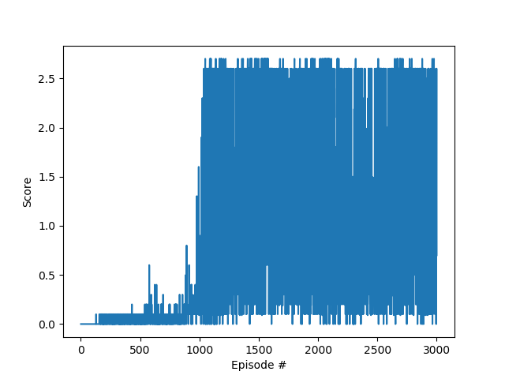

# drl_collaboration
# Project 3: Collaboration with MADDPG by Tony Ho

### Report

The implementation of this MADDPG algorithm was created by using the DDPG algorithm I used in the Continous project and a multiagent implementation that makes use of a shared replay buffer.
The hyperparameters were changed from the Continous project, with changes including TAU and the number of episodes.
This MADDPG network is made up of two DDPG models, each with an Actor network and Critic network, with each of those having two networks, one as a target network and the other as a training network.
The networks I used had a input layer of 8 nodes, first hidden layer of 400 nodes, second hidden layer of 300 nodes and an ouput layer of 2 nodes.
The input layer reflects the number of values derived from the state and the output layer reflects the number of actions.
Each learning step would do a soft update where the target network would assimulate part of the values of the training network.

Using the hyperparameters from the Continuous project resulted in no convergence.  Ultimately, the only hyperparameter changed was TAU, going from 1e-3 to 1e-2.
After doing this, the training showed consistant increases in rewards over time.

### Hyperparameters

BUFFER_SIZE = int(1e6)  # replay buffer size
BATCH_SIZE = 64         # minibatch size
GAMMA = 0.99            # discount factor
TAU = 1e-2				# for soft update of target parameters
LR_ACTOR = 1e-4         # learning rate of the actor 
LR_CRITIC = 1e-4        # learning rate of the critic
WEIGHT_DECAY = 0.0001   # L2 weight decay

### Rewards Training Graph

The environment was solved at episode 1100 with a score of 1.67

### Future Ideas

The agent's performance could be improved by reducing the amount of noise added initially.
I could change the initial percent of noise used from 100% to something like 50% and then decay more aggressively to reach convergence in less episodes.
The plot of rewards seem to indicate that learning was happening even though the rewards reflected were at a plateau because at a certain point, the rewards are dramatically increased.
I think this is because the influence of noise on the agents' actions are small enough that the actions they take are much more reflective of their intent.

I tried to reduce the number of nodes required in each hidden layer but lowering them from (400, 300) to (200, 100) resulted in an upper bound that was lower than the required reward amount to complete the environment.
The idea amount of nodes in the hidden layers could changed to an amount between these two.  Having less nodes will result in less calculations, less CPU cycles and therefore less training time required.